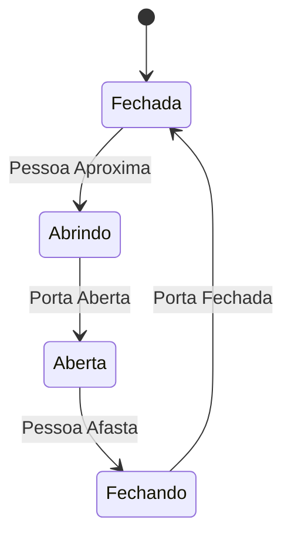
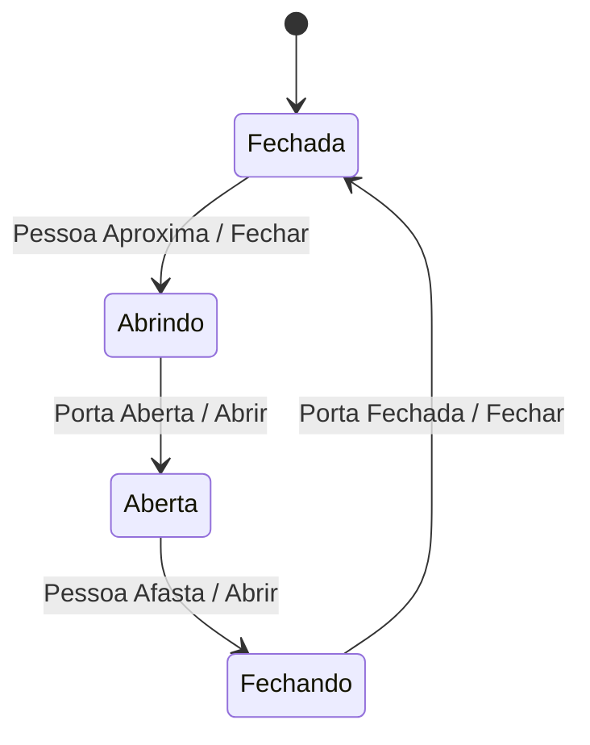

# Máquinas de Estado

## Introdução

Máquinas de estado são circuitos sequenciais que podem estar em diferentes estados e mudar de um estado para outro em resposta a estímulos externos. Elas são usadas para modelar sistemas com comportamento complexo e regras de transição bem definidas. Máquinas de estado são amplamente utilizadas em sistemas digitais, automação industrial, controle de processos e muitos outros campos.

## Tipos de Máquinas de Estado

Existem dois tipos principais de máquinas de estado:

- **Máquina de Moore**: As saídas dependem apenas do estado atual.
- **Máquina de Mealy**: As saídas dependem tanto do estado atual quanto das entradas.

## Componentes de uma Máquina de Estado

Uma máquina de estado é composta por:

- **Estados**: Representam as diferentes condições ou configurações do sistema.
- **Entradas**: Sinais externos que influenciam as transições de estado.
- **Saídas**: Sinais gerados pela máquina de estado.
- **Transições**: Regras que definem como a máquina de estado muda de um estado para outro com base nas entradas.

## Exemplo Motivador

Vamos considerar um exemplo motivador ao longo deste material: um sistema de controle de portas automáticas. Esse sistema deve abrir a porta quando uma pessoa se aproxima e fechar a porta quando a pessoa se afasta.

## Máquina de Moore

### Diagrama de Estados

Um diagrama de estados para a máquina de Moore do sistema de controle de portas automáticas pode ser representado da seguinte forma:

### Tabela de Transição de Estados

A tabela de transição de estados para a máquina de Moore é:

| Estado Atual | Entrada          | Próximo Estado | Saída   |
|--------------|------------------|----------------|---------|
| Fechada      | Pessoa Aproxima  | Abrindo        | Fechar  |
| Abrindo      | Porta Aberta     | Aberta         | Abrir   |
| Aberta       | Pessoa Afasta    | Fechando       | Abrir   |
| Fechando     | Porta Fechada    | Fechada        | Fechar  |

## Máquina de Mealy

### Diagrama de Estados

Um diagrama de estados para a máquina de Mealy do sistema de controle de portas automáticas pode ser representado da seguinte forma:

### Tabela de Transição de Estados

A tabela de transição de estados para a máquina de Mealy é:

| Estado Atual | Entrada          | Próximo Estado | Saída   |
|--------------|------------------|----------------|---------|
| Fechada      | Pessoa Aproxima  | Abrindo        | Fechar  |
| Abrindo      | Porta Aberta     | Aberta         | Abrir   |
| Aberta       | Pessoa Afasta    | Fechando       | Abrir   |
| Fechando     | Porta Fechada    | Fechada        | Fechar  |

## Implementação de Máquinas de Estado

Máquinas de estado podem ser implementadas usando flip-flops e lógica combinacional. A implementação envolve a definição dos estados, entradas, saídas e transições, bem como a codificação dos estados em binário.

### Exemplo de Implementação

Vamos implementar a máquina de estado de Moore para o sistema de controle de portas automáticas usando flip-flops D.

#### Definição dos Estados

| Estado   | Código Binário |
|----------|----------------|
| Fechada  | 00             |
| Abrindo  | 01             |
| Aberta   | 10             |
| Fechando | 11             |

#### Tabela de Transição de Estados

###TODO: Corrigir

| Estado Atual (Q1 Q0) | Entrada (Pessoa Aproxima) | Próximo Estado (D1 D0) | Saída (Porta) |
|----------------------|---------------------------|------------------------|---------------|
| 00                   | 0                         | 00                     | Fechar        |
| 00                   | 1                         | 01                     | Abrir         |
| 01                   | 0                         | 01                     | Abrir         |
| 01                   | 1                         | 10                     | Abrir         |
| 10                   | 0                         | 11                     | Abrir         |
| 10                   | 1                         | 10                     | Abrir         |
| 11                   | 0                         | 00                     | Fechar        |
| 11                   | 1                         | 11                     | Fechar        |

#### Circuito Lógico

O circuito lógico para a máquina de estado de Moore pode ser construído usando flip-flops D e portas lógicas para implementar as transições de estado e as saídas.

## Conclusão

Máquinas de estado são ferramentas poderosas para modelar e implementar sistemas com comportamento complexo. Elas permitem a definição clara de estados, entradas, saídas e transições, facilitando o design e a análise de sistemas digitais. O exemplo motivador do sistema de controle de portas automáticas ilustra como máquinas de estado podem ser usadas para resolver problemas práticos.

