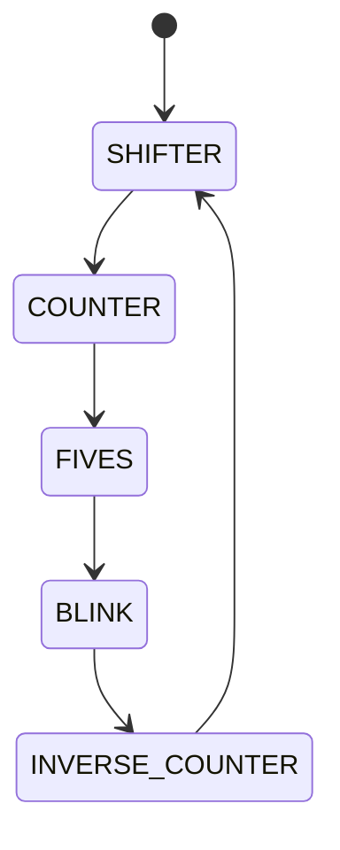

# Modos de Botão  

Até agora, construímos circuitos que trabalham apenas com **entradas e saídas**, sem possuir **estado interno**. Nesta atividade, exploraremos o uso de **máquinas de estados** para construir um circuito capaz de **alterar o modo de operação** de um conjunto de LEDs ao pressionar um botão.  

## Recomendações  

Antes de iniciar, recomendamos que você leia o conteúdo disponível em [Máquinas de Estados](/verilogMaquinasDeEstados/), pois ele fornecerá a base necessária para esta atividade.  

## Atividade  

Seu objetivo é escrever um módulo Verilog chamado **Button_Modes**, que deve:  

- Ter um **parâmetro** chamado `CLK_FREQ`, que representa a frequência do clock.  
- Ter como **entradas** os sinais:  
  - `clk` (clock).  
  - `rst_n` (reset ativo em nível baixo).  
  - `btn` (botão, ativo em nível alto).  
- Ter como **saída** um sinal de 8 bits chamado `leds`.  

### Comportamento esperado  

O módulo deve implementar uma **máquina de estados finita (FSM)** com **cinco modos de operação**, na seguinte ordem:  

1. **SHIFTER**  
2. **COUNTER**  
3. **FIVES**  
4. **BLINK**  
5. **INVERSE_COUNTER**  

- Ao ser **resetado**, o módulo deve iniciar no estado **SHIFTER**.  
- Sempre que o botão for pressionado, o módulo deve mudar para o **próximo modo**.  
- Após chegar ao estado **INVERSE_COUNTER**, a próxima transição deve retornar ao estado **SHIFTER**.  

### Implementação de cada estado  

1. **SHIFTER**  
   - Inicializa um registrador com `8'b00011111` (0x1F).  
   - Desloca os bits **para a esquerda** a cada 1 segundo.  

2. **COUNTER**  
   - Implementa um contador de **8 bits**, que inicia em **0**, conta até **255** e volta para **0**.  
   - Incrementa o contador a cada **1 segundo**.  

3. **FIVES**  
   - Mesmo comportamento do estado **SHIFTER**, mas inicia com `8'b01010101` (0x55).  

4. **BLINK**  
   - Todos os LEDs piscam a cada **1 segundo**.  

5. **INVERSE_COUNTER**  
   - Mesmo comportamento do estado **COUNTER**, mas o contador inicia em **255** e decrementa até **0**.  

### Diagrama de transição de estados  



### Implementação do Debouncing  

Além da **lógica de estados**, você deve implementar um **filtro de bouncing** para o botão.  

- Em FPGAs, uma abordagem eficiente é utilizar um **contador** para estabilizar o sinal do botão.  
- Para hardware real, um tempo entre **1/4 de segundo e 1 segundo** é um bom ponto de partida.  
- Para **simulação e correção automática**, considere que o botão pode permanecer pressionado por **até 2 ciclos de clock**.  

### Código inicial  

Como ponto de partida, você pode utilizar o esqueleto de código abaixo:  

```verilog
module Button_Modes #(
    parameter CLK_FREQ = 25_000_000 
) (
    input wire clk,
    input wire rst_n,
    input wire btn,
    output reg [7:0] leds
);

endmodule
```

## Entrega  

Para realizar a entrega, basta enviar o arquivo **button_modes.v** para o GitHub.  

O **GitHub Classroom** já está configurado para verificar a entrega e atribuir notas automaticamente com base nos testes.  

!!! note "Dica"
    Os testes do GitHub estão embutidos nos arquivos do laboratório. Se quiser saber mais sobre eles, consulte o script de correção `run.sh` no repositório do GitHub. **Não altere os arquivos de correção!**  
