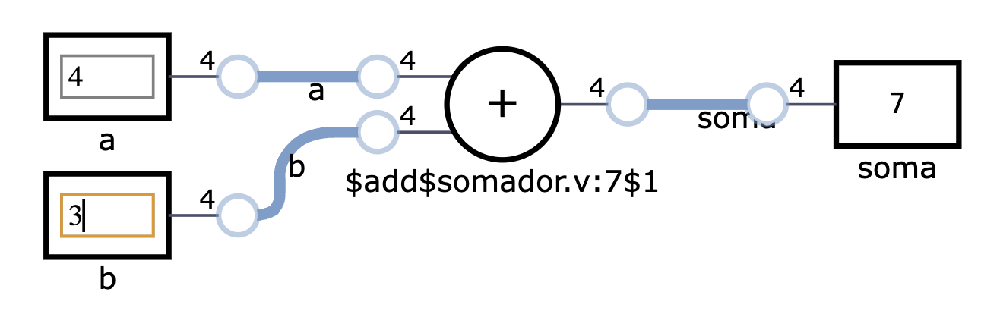

# Como simular esse código?

Até aqui, você viu como o circuito pode ser descrito em Verilog e como pode utilizar Verilog também para verificar o circuito. Agora, vamos ver as ferramentas necessárias para poder realizar essa verificação.

## Icarus Verilog

A primeira ferramenta que vamos utilizar é o [Icarus Verilog](https://steveicarus.github.io/iverilog). O Icarus Verilog é um compilador de Verilog que permite compilar e simular circuitos descritos em Verilog. O Icarus Verilog é uma ferramenta de código aberto e pode ser utilizada em sistemas operacionais Windows, Linux e MacOS. Recomendo o uso do guia de instalação da página da ferramenta para instalar em seu sistema operacional de preferência.

Uma vez instalado, considerando os códigos que foram apresentados, você pode compilar e simular o circuito utilizando os comandos abaixo (para Linux):

```bash
iverilog -o somador somador.v tb_somador.v
./somador
```

A saída será exatamente a mostrada acima, com os sinais sendo impressos na tela, linha a linha conforme as entradas fornecidas.

!!! Dica
    O comando **iverilog** é utilizado para compilar o código Verilog. O comando **-o** é utilizado para indicar o nome do arquivo de saída. O comando **./somador** é utilizado para executar o arquivo de saída. O compilador detectou automaticamente que o módulo principal é o **tb_somador** e que o módulo **somador** é uma dependência.

## GTKWave

Vocë pode também modificar o Verilog para que ele gere um arquivo com as formas de ondas do seu circuito. Para isso, basta adicionar as duas linhas após **initial begin** da listagem abaixo:

```verilog
  initial begin
    $dumpfile("tb_somador.vcd");
    $dumpvars(0, tb_somador);
    $monitor("a = %b, b = %b, soma = %b", a, b, soma);
```

Ao recompilar e executar essa nova versão do código, a saída será a mesma na tela mas também será gerado um arquivo chamado **tb_somador.vcd** que pode ser aberto pelo programa **gtkwave**. O **gtkwave** é um visualizador de formas de onda que permite visualizar as formas de onda geradas pelo circuito. O **gtkwave** é uma ferramenta de código aberto e pode ser utilizada em sistemas operacionais Windows, Linux e MacOS. Recomendo o uso do guia de instalação da página da ferramenta para instalar em seu sistema operacional de preferência.

###TODO: Adicionar imagem do gtkwave

## DigitalJS

Existem duas principais versões do DigitalJS que são mais facilmente utilizadas. A primeira é a versão [online](https://digitaljs.tilk.eu/) e a segunda é uma versão instalada diretamente como plugin no VSCode. Em ambos os casos, você poderá, visualmente, editar as entradas do circuito e ver como estão as saídas após o processamento pelo seu circuito.



A figura acima mostra o diagrama do circuito gerado pelo Digital JS ao simular o arquivo **somador.v**. Nele é possível alterar os valores das entradas, a=4 e b=3 (inclusive selecionando a base do sistema de numeração) e ver o resultado na saída com soma=7.

## Outras ferramentas

Existem outras ferramentas que podem auxiliar o desenvolvimento de código em Verilog. Um pouco mais a frente no curso elas serão apresentadas. Uma categoria especial de ferramentas não mencionadas até agora são as ferramentas se síntese de circuitos para utilização em FPGA ou ASIC. Elas serão apresentadas em breve no curso.
