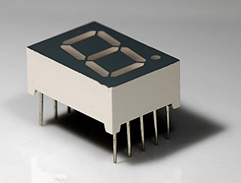
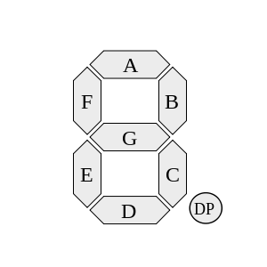

# Display de 7 segmentos

Um circuito clássico muito utilizado para demonstrações de conceitos relacionados a projeto de hardware é o display de 7 segmentos. Este circuito é composto por 7 leds que podem ser ligados ou desligados individualmente para formar números de 0 a 9. A figura abaixo ilustra visualmente um display de 7 segmentos.

 

A cada led é atribuída uma letra diferente cuja equação lógica precisa ser definida. A figura abaixo indica a atribuição das letras.



Da figura, podemos observar que para indicar o número 1, é preciso acender os leds B e C. O mesmo raciocínio pode ser feito para os demais dígitos. É possível modelar um conversor de dígito para display de 7 segmentos em Verilog conforme abaixo:

```verilog
module ConversorBinario7Segmentos(
    input [3:0] numero,
    output reg [6:0] segmentos
);

always @(numero)
begin
    case(numero)
        4'b0000: segmentos = 7'b1111110; // 0
        4'b0001: segmentos = 7'b0110000; // 1
        4'b0010: segmentos = 7'b1101101; // 2
        4'b0011: segmentos = 7'b1111001; // 3
        4'b0100: segmentos = 7'b0110011; // 4
        4'b0101: segmentos = 7'b1011011; // 5
        4'b0110: segmentos = 7'b1011111; // 6
        4'b0111: segmentos = 7'b1110000; // 7
        4'b1000: segmentos = 7'b1111111; // 8
        4'b1001: segmentos = 7'b1111011; // 9
        default: segmentos = 7'b0000000; // Entrada inválida
    endcase
end

endmodule
```

Além da definição do módulo, que já foi vista anteriormente, alguns comandos novos de Verilog são mostrados nesse código. O primeiro é o bloco *always*. Ao contrário do assign que trabalha com uma expressão (linha), o always tipicamente conterá blocos maiores de comando. A sintaxe básica do always é seguida pela *lista de sensibilidade*, que é um conjunto de sinais que, quando alterados, geram uma mudança na saída do always. É possível alterar o cabeçalho do bloco colocando um asterisco (*) no lugar do sinal numero para que o bloco seja sensível a qualquer sinal. Prefere-se sempre indicar os sinais para facilitar a legibilidade do código.

Dentro do always, temos um bloco *case* cuja sintaxe é bem próxima da linguagem C: cada linha indica um valor da variável numero e o que acontecerá caso esse seja o valor. Então, a primeira linha tem o valor 4'b0000 (valor de 4 bits em binário 0000, que equivale ao valor 0), que implica em resposta = 7'b1111110 (valor de 7 bits em binário 1111110).

Apesar de termos exaurido as opções de dígitos, é importante sempre incluir a cláusula *default* que indica o que deve acontecer caso o número seja diferente das opções anteriores. Note que sem o default, não há clareza sobre o que acontecerá caso o número de entrada seja 10 ou um valor maior.

!!! Dica
    A cláusula *default* ajuda a evitar a síntese de latches desnecessários no circuito, como veremos em detalhes posteriormente. Por enquanto, apenas lembre-se de colocar sempre a cláusula em todos os cases.

## Pratique

1. Copie e cole o código acima no seu editor e implemente o módulo de teste (tb_ConversorBinario7Segmentos.v) para testa-lo.
2. Faça um circuito com 3 displays utilizando o componente que acabou de criar.


